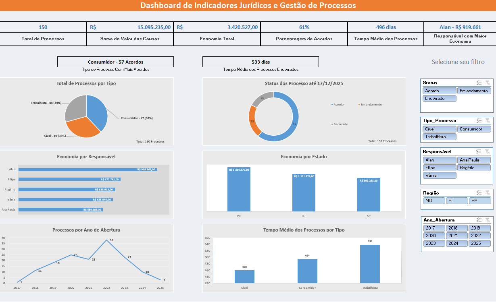
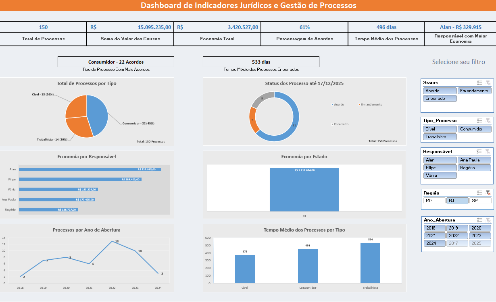
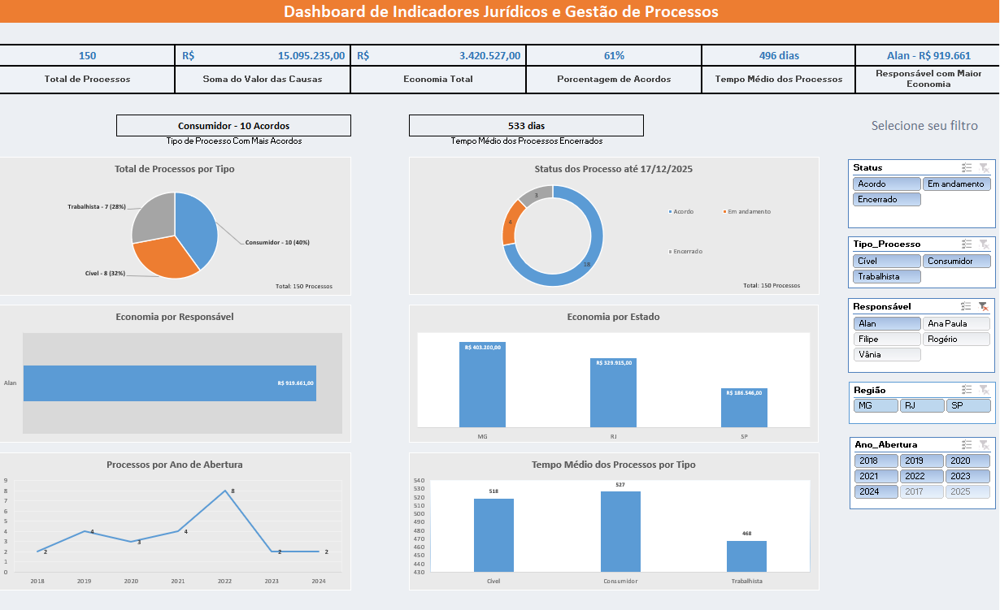
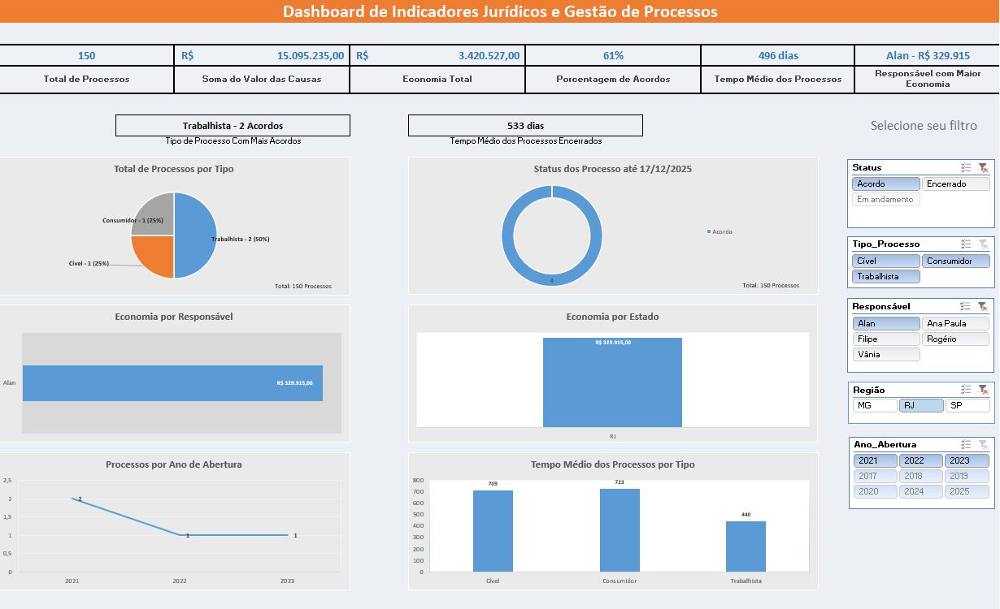
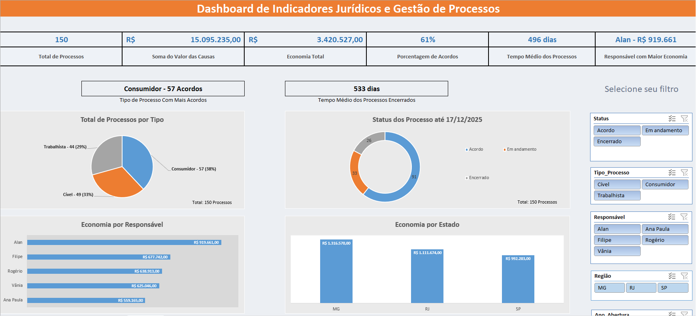

# Legal Dashboard in Excel: Operational and Financial Indicators

## About the project

This project was created as a way to combine my legal background with my studies in data analytics.

The idea was to build an interactive Excel dashboard capable of analyzing a simulated legal case portfolio from different perspectives: operational, financial and strategic.

The dataset used in this project simulates a legal portfolio between 2017 and 2025, allowing analyses related to portfolio evolution, settlements, generated savings and average case duration.

Instead of working only with isolated charts, the main focus was to create an executive-style dashboard capable of identifying patterns, generating insights and presenting information in a clear and intuitive way.

The entire project was developed using native Excel features.

---

## Objectives

The dashboard was designed to support analyses related to:

* case volume;
* case type distribution;
* settlement rate;
* generated savings;
* average case duration;
* performance by responsible professional;
* portfolio evolution over the years.

Beyond the analytical side, the project also focused on visual organization, user experience and building a clean and intuitive dashboard.

---

## Tools Used

* Microsoft Excel
* Pivot Tables
* Pivot Charts
* Data Slicers
* KPIs
* Excel Formulas

---

## Dashboard Preview

### Filter by Region

### Filter by Responsible

### Combined Filters

### Financial Analysis

---

## Dashboard Structure

The dashboard was divided into four main areas:

### Executive KPIs

General portfolio indicators:

* Total Cases
* Total Claim Value
* Total Savings Generated
* Settlement Rate
* Average Case Duration
* Professional with Highest Savings Generated

### Complementary Indicators

* Case Type with Most Settlements
* Average Duration of Closed Cases

### Analytical Charts

* Case distribution by type;
* Status distribution;
* Savings by professional;
* Savings by state;
* Cases by opening year;
* Average duration by case type.

### Interactive Slicers

Filters by:

* Status
* Case Type
* Responsible Professional
* Opening Year
* Region

---

## Key Insights

### Portfolio evolution

The highest number of new cases occurred in 2022.

After that period, the portfolio started to show a gradual reduction in new cases, simulating a possible strategic shift in the firm's area of practice over the following years.

### Settlements

The portfolio showed a high concentration of cases resolved through settlements, indicating a strong focus on consensual dispute resolution.

### Performance by professional

Even without handling the largest number of cases, some professionals generated the highest savings values, suggesting either involvement in higher financial impact cases or greater effectiveness in negotiations.

### Average duration

Closed cases showed a higher average duration compared to the overall portfolio average, suggesting that ongoing cases tend to be more recent.

---

## Visual Organization

One of the main concerns during development was avoiding the traditional appearance of "spreadsheets with loose charts".

Because of that, the dashboard was structured using:

* visual separation between sections;
* consistent color palette;
* hierarchical organization of information;
* side filters;
* card-based layout;
* focus on readability.

---

## Next Steps

Some possible future improvements for the project:

* migration to Power BI;
* automated data treatment;
* database integration;
* creation of new indicators;
* automatic dataset updates.

---

## About Me

I am a lawyer transitioning into the Data field, with a focus on data analytics, business intelligence and artificial intelligence applied to business operations.

This project was developed as a way to strengthen practical skills in data visualization, dashboard development and analytical interpretation.

---

## Contact

* LinkedIn: https://www.linkedin.com/in/advfilipecunha/
* GitHub: https://github.com/filipecunhaadv
